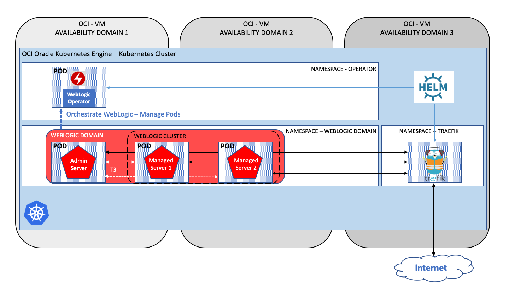

# Oracle WebLogic Operator Tutorial #

### Deploy Oracle WebLogic Domain (*Domain-home-in-image*) on Kubernetes using Oracle WebLogic Operator  ###

This lab demonstrates how to deploy and run Weblogic Domain container packaged Web Application on Kubernetes Cluster using [Oracle WebLogic Server Kubernetes Operator 2.0](https://github.com/oracle/weblogic-kubernetes-operator).

The demo Web Application is a simple JSP page which shows WebLogic Domain's MBean attributes to demonstrate WebLogic Operator features.

**Architecture**

WebLogic domain can be located either in a persistent volume (PV) or in a Docker image. (There are advantages to both approaches, and there are sometimes technical limitations)[https://github.com/oracle/weblogic-kubernetes-operator/blob/2.0/site/domains.md#create-and-manage-weblogic-domains] of various cloud providers that may make one approach better suited to your needs.

This tutorial implements the Docker image with the WebLogic domain inside the image deployment. This means all the artefacts, domain related files are stored within the image. There is no central, shared domain folder from the pods. This is similar to the standard installation topology where you distribute your domain to different host to scale out Managed servers. The main difference is that using container packaged WebLogic Domain you don't need to use pack/unpack mechanism to distribute domain binaries and configuration files between multiple host.

In Kubernetes environment WebLogic Operator ensures that only one Admin and multiple Managed servers will run in the domain. An operator is an application-specific controller that extends Kubernetes to create, configure, and manage instances of complex applications. The Oracle WebLogic Server Kubernetes Operator (the "operator") simplifies the management and operation of WebLogic domains and deployments.

Helm is a framework that helps you manage Kubernetes applications, and helm charts help you define and install Helm applications into a Kubernetes cluster. Helm has two parts: a client (Helm) and a server (Tiller). Tiller runs inside of your Kubernetes cluster, and manages releases (installations) of your charts.

### Prerequisites ###

- Running Kubernetes cluster. You can use [Oracle Container Engine for Kubernetes (OKE)](setup.oke.md) cluster. This tutorial has been tested on OKE.
- Desktop with Oracle Cloud Infrastructure CLI, `kubectl`, `helm`. [Download](https://drive.google.com/open?id=11CvOZ-j50-2q9-rrQmxpEwmQZbPMkw2a) and import the preconfigured VirtualBox image (total required space > 12 GB)
  - [Download VirtualBox](https://www.virtualbox.org/wiki/Downloads) if necessary.
- Desktop with `kubectl` and `helm` installed. `kubectl` has to be configured to access to the Kubernetes Cluster. In case of [OKE follow the tutorial](setup.oke.md) to configure `kubectl` access.
- [WebLogic Domain image available from container registry](build.weblogic.image.pipeline.md).

### The topics to be covered in this hands-on session are: ###

1. [Create Oracle Container Pipelines to build custom WebLogic Domain image](build.weblogic.image.pipeline.md)
2. [Install Traefik software loadbalancer](install.traefik.md)
3. [Install WebLogic Operator](install.operator.md)
4. [Deploy WebLogic Domain](deploy.weblogic.md)
5. [Scaling WebLogic cluster using `kubectl`](scale.weblogic.md)
6. [Override JDBC Datasource parameters](override.jdbc.md)
7. [Update Web Application](update.application.md)
